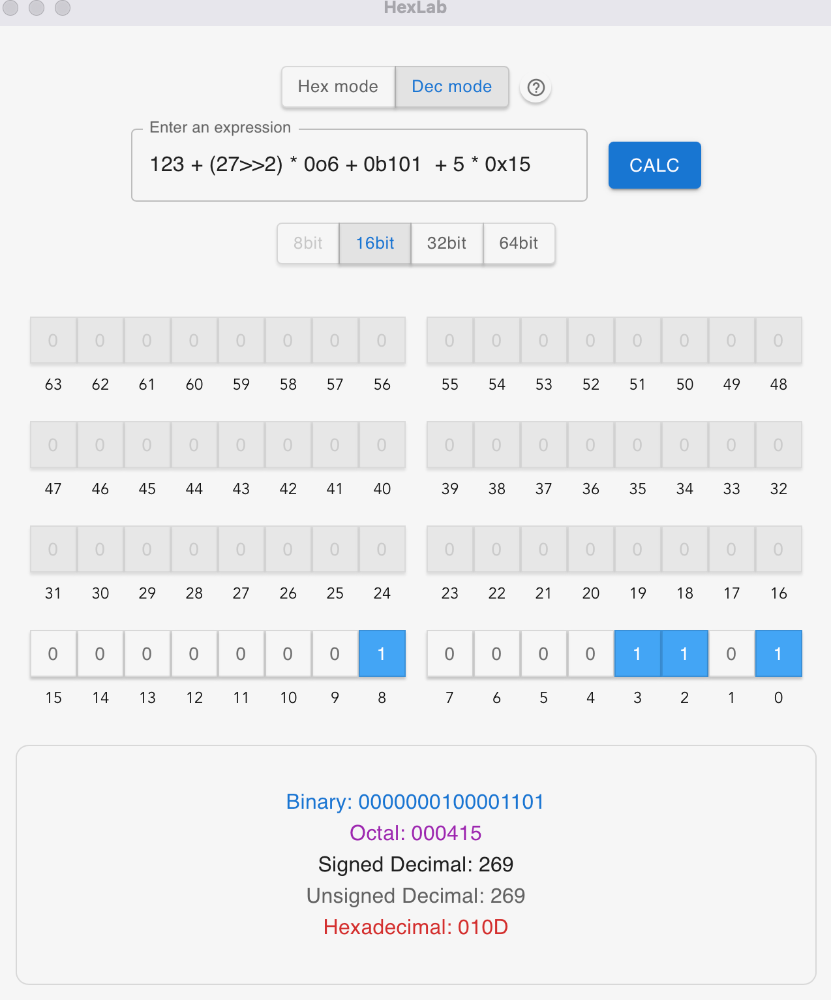

# Hexlab


- [Hexlab](#Hexlab)
  - [History](#history)
  - [Installation](#installation)
    - [Prebuilt binary](#prebuilt-binary)
    - [Build from source](#build-from-source)
  - [Command line Usage](#command-line-usage)
    - [Numbers](#numbers)
    - [Set directives](#set-directives)
    - [Temporary format conversion](#temporary-format-conversion)
    - [Inline evaluation](#inline-evaluation)
    - [Script evaluation](#script-evaluation)
    - [Punctuation](#punctuation)
  - [Configuration](#configuration)
    - [Locations](#locations)
    - [Keys](#keys)
  - [LICENSE](#license)



Hexlab is a calculator designed for programmers, supporting common calculations and allowing individual bit toggling.
## History

As a reverse security researcher, I frequently need to calculate various hexadecimal offsets and masks. While the operating system's built-in calculator can handle these tasks, it's often cumbersome to use - it's difficult to input long expressions, the binary bit display is too small and hard to click, and there's no way to change the bit width of the current display results. Later, I discovered [Cork](https://github.com/RedDocMD/cork), a terminal command-line program that mostly met my needs. However, I often needed to perform bit-flipping calculations, and I wished I could toggle individual bits with a simple click. One boring afternoon, after learning about the Tauri framework, I decided to add a GUI interface to Cork, and that's how Hexlab was born. While gaining a GUI interface, I also maintained the command-line interface, which is still called Cork.

## Installation

### Prebuilt binary

For MacOS, you can download a pre-built binary [here]().

### Build from source

If you have `cargo` installed, then you can build this from source:

```shell
git clone https://github.com/FischLu/Hexlab
cd Hexlab
yarn install
yarn tauri build
```

The binary produced will be `src-tauri/target/release/bundle`.

## Command line Usage

Most of the documentation below comes from Cork. Out of respect, you'll see "cork" in the command-line interface. For my extensions (such as setting mode), I've also provided corresponding documentation. The basic usage of the command-line mode is consistent with Cork - you just need to add the `-i` parameter to start the command-line mode. For macOS, you'll need to locate the original executable in the bundle, for example:

```shell
/Applications/hexlab.app/Contents/MacOS/hexlab -i
```

The subsequent usage is identical to Cork:

```text
Welcome to cork - a calculator for hex-lovers!
Press Ctrl + D to exit.
cork> 0xCAFE
0xcafe
cork> 0xCAFE + 2 * 8 * 0x20
0xccfe
cork> set of dec
cork> ans
52478
cork> 0xCAFE
51966
Exiting ...

```

Oh, btw, Cork uses [rustyline](https://github.com/kkawakam/rustyline). So you get the whole `readline` goodness (including a history).

Cork also features an inline-expression evaluation mode (probably useful in scripts).

In addition, Cork can be run on a file (**scripting-mode**), which executes the file as a script.

### Numbers

Cork accepts four types of numbers:

- Decimal: These are regular numbers prefixed by `0d` (10, 23245, 4124, etc).
- Hexadecimal: These are numbers prefixed by `0x` (0xaA 0x5acd, 0x101c, etc).
- Octal: These are numbers prefixed by `0o` (0o12, 0o55315, 0o10034, etc).
- Binary: These are numbers prefixed by `0b` (0b1010, 0b101101011001101, 0b1000000011100, etc).

In addition, `ans` holds the answer of the last computation. It is initialized to `0` on startup.

**Underscores (_)** are allowed as separators.

### mode

You don't always need to add a prefix before numbers. If the current mode is hex, any number without a prefix will be interpreted as hexadecimal. In this case, if you want to input a decimal number, you need to use the `0d` prefix. Similarly, if the current mode is dec, any number without a prefix will be interpreted as decimal.

### Set directives

Cork has something called set directives, which basically set some global property. They are of the form

```text
set <key> <value>
```

As of now, Cork has the following keys:

| Key | Possible Values    | Purpose                |
| --- | ------------------ | ---------------------- |
| of  | hex, dec, oct, bin | Sets the output format |
| mode  | hex, dec | Sets the mode |

### Temporary format conversion

A `number`, `ans` or the result of an `expression` can be temporary converted to a
different output format without change the default one. The 'to' command can
have the forms

```text
<number> to <radix>
```
```text
ans to <radix>
```
```text
<expression> to <radix>
```

Supported output formats are:

| Possible Formats   |
| ------------------ |
| hex, dec, oct, bin |

Example:

```text
cork> 0xCAFE to dec
51966
cork> 0xCAFE + 2 * 8 * 0x20 to bin
0b1100110011111110
cork> ans to hex
0xccfe
cork>
```

### Inline evaluation

With the `-e/--expr` flag, Cork accepts an expression to evaluate. The expression cannot be a set-directive. The expression is evaluated and the answer is printed in the default output radix. The `-a/--all-bases` flag prints the result in all the four bases.

### Script evaluation

With the `-f/--file` flag, Cork accepts the path of a file. This file will be executed as a script from top to bottom. Any command allowed in the REPL is allowed in the script. The script will print its outputs to `stdout` and its errors to `stderr`.

### Punctuation

The `-p/--punctuate-output` flag punctuates the output numbers with underscores. The same can be done with a key of the same name in the config file. The presence of this flag overrides the option set in the config file.

## Configuration

Cork accepts a config file in YAML. In absence of one, default values are assumed.

### Locations

Cork accepts a path for its config file by the `-c/--config` option.

Otherwise, Cork looks at the following places for a config file (in the specified order):

1. `$HOME/.cork.yml`
2. `$HOME/.cork/cork.yml`
3. `$HOME/.config/cork/cork.yml`

### Keys

| Key              | Possible Values             | Default | Purpose                                      |
| ---------------- | --------------------------- | ------- | -------------------------------------------- |
| prompt           | `string`                    | cork>   | Prompt to show at the beginning of each line |
| default_radix    | Decimal, Hex, Octal, Binary | Hex     | Default radix for the output format          |
| header           | `bool`                      | true    | Show the header at startup                   |
| punctuate_output | `bool`                      | false   | Punctuate output numbers with underscores    |

## LICENSE

Hexlab is released under [GNU General Public License, v2](https://github.com/RedDocMD/cork/blob/main/LICENSE).
